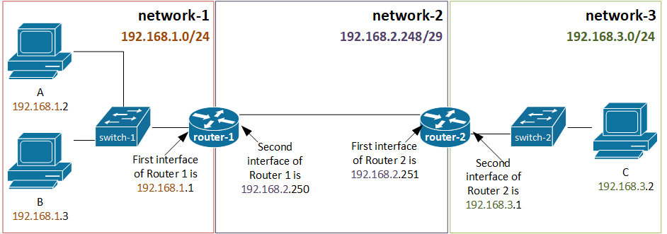
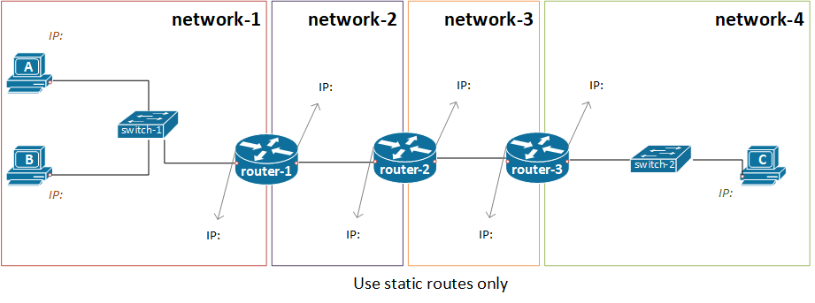
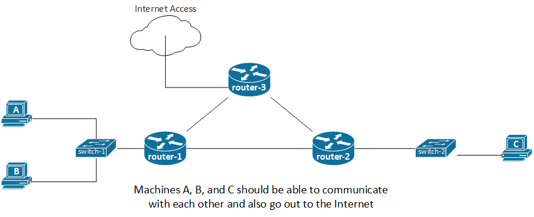

# Internetworking basics - Connecting three networks with two routers - Static Routing

## Lab Purpose

This lab will help build on your knowledge of internetworking to connect three networks together using two routers and static routing; while working in OpenStack.

### Learning Outcomes

Upon completion of this lab, you will be able to:

1. Create virtual networks in OpenStack based cloud environments
2. Create and deploy IP networks
3. Create and configure routers to interconnect networks using static routes
4. Describe routing process as initiating at the host
5. Describe routing process at a router and use of additional routes (here static routes) to make routers aware of remote networks

### Prerequisites

#### Environment

1. You should have already received instructions on logging into the OpenStack lab environment from your instructor
2. Any computer with Internet access should work. Latest versions of Chrome and Firefox browsers are preferable.

#### Background Knowledge

1. Familiarity with virtualization concepts and basic working knowledge of Linux command line will be beneficial but not required.
2. Understanding of Network Addresses, Dynamic versus Static IP configuration of hosts, and theory on decision making at hosts and routers as they decide how to forward Layer 3 datagrams.
3. Ideally, completion of internetworking lab with one router setup.

>**Note**: you can finish most of the tasks (except Key Pair generation) below from the Network Topology view in the OpenStack Dashboard (Project->Network->Network Topology). The Graph view with "Toggle Labels" will present a nice picture of what you're building. It's a great way to understand networking concepts!

## Create your networks

You'll create private networks on which you'll launch your instances and router(s) will interconnect the networks. You can create a network from the dashboard. While creating a network, you'll also create a Subnetwork. For the subnetwork, you can pick any RFC 1918 private Internet Protocol Version 4 (IPv4) block you wish. Example setup using private IP addresses and network addresses for IPv4 appears below. You may choose your own network addresses if you wish.

>Use the below values/inputs [while following the general instructions on how to create a network in OpenStack Dashboard here](../../tasks/openstack/create-network.md). Be sure you use the values specified below and not the ones in the general instructions.

### Create first network - "network-1"

1. Network Name: `network-1` (just a name, always try to give descriptive names to your cloud resources)
2. Other inputs/check boxes: Not Shared; Admin State enabled; and create a subnet.
3. Subnet:
   * Subnet Name: `network-1-subnet`
   * Network Address: `192.168.1.0/24`
   * Gateway IP: `192.168.1.1`
   * Subnet Details:
      1. DHCP enabled
      2. DHCP Allocation Pools: `192.168.1.10,192.168.1.254`
      3. DNS SERVER: (not needed, leave blank; as these are test networks with no outside connectivity)
      4. Rest of the configuration either blank or default

### Create second network - "network-2"

This will be a network between the two routers. You can imagine this as a Wide Area Network connection with a point-to-point link. For now, we'll simply use a /29 network to model this idea. A /29 network will give us 8 total (2^(32-29)) and 6 usable ((2^(32-29))-2) IP addresses. This is more than the two needed for a point-to-point link but gives us flexibility for growth if needed.

1. Network Name: `network-2` (just a name, always try to give descriptive names to your cloud resources)
2. Other inputs/check boxes: Not Shared; Admin State enabled; and create a subnet.
3. Subnet:
   * Subnet Name: `network-2-subnet`
   * Network Address: `192.168.2.248/29` (We're making this network /29. We'll reserve 192.168.2.249 for a future gateway in case we need it. We'll use 192.168.2.250 for router-1 and 102.168.2.251 for router 2.)
   * Gateway IP: `192.168.2.249` (this is currently not being used by any router... just entering it as a placeholder)
   * Disable Gateway: `unchecked (enabled)`
   * Subnet Details:
      1. Enable DHCP `unchecked (disabled)`
      2. DHCP Allocation Pools: `192.168.2.250,192.168.2.254`
      3. DNS SERVER: (not needed, leave blank)
      4. Rest of the configuration either blank or default

### Create third network - "network-3"

1. Network Name: `network-3`
2. Other inputs/check boxes: Not Shared; Admin State enabled; and create a subnet.
3. Subnet:
   * Subnet Name: `network-3-subnet`
   * Network Address: `192.168.3.0/24`
   * Gateway IP: `192.168.3.1`
   * Subnet Details:
      1. DHCP enabled
      2. DHCP Allocation Pools: `192.168.3.10,192.168.3.254`
      3. DNS SERVER: (not needed, leave blank; as these are test networks with no outside connectivity)
      4. Rest of the configuration either blank or default

## Create your routers

>Use the below values/inputs [while following the general instructions on how to create a router in OpenStack Dashboard here](../../tasks/openstack/create-router.md). Be sure you use the values specified below and not the ones in the general instructions.

### Create first router (router-1) that connects network-1 with network-2

1. Router name: `router-1`
2. External Network: LEAVE BLANK
3. Add an interface to this router on your `network-1-subnet`:
   * IP Address: `192.168.1.1` (this will be the gateway for all instances launched in your network-2-subnet)
4. Add second interface to this router on your `network-2-subnet`:
   * IP Address: `192.168.2.250`

### Create second router (router-2) that connects network-2 with network-3

1. Router name: `router-2`
2. External Network: LEAVE BLANK
3. Add interface to this router on your `network-2-subnet`:
   * IP Address: `192.168.2.251`
4. Add a second interface to this router on your `network-3-subnet`:
   * IP Address: `192.168.3.1` (this will be the gateway for all instances launched in your network-3-subnet)

>**Note:** We also need to add static routes on each router for the corresponding "remote" network. We're going to do that later after we test existing setup and understand that it's not going to work without static routes.

## Create Key Pair (if needed)

If you don't already have a Key Pair setup, create a SSH Key Pair and download to save in your .ssh directory. Use the below values/inputs [while following the instructions on how to create a key pair in OpenStack Dashboard here](../../tasks/openstack/create-key-pair.md).

1. Key Pair Name: `ssoid-key` (replace with your ssoid or username)

## Launch Your Instances

>Use the below values/inputs [while following the general instructions on how to launch a linux instance in OpenStack Dashboard here](../../tasks/openstack/launch-ubuntu-instance.md).  Be sure you use the values specified below and not the ones in the general instructions.

### Launch Linux instance; "machine-A" on network-1

1. Instance name: `machine-A`
2. Source Image: `Ubuntu-16-04` (no volumes)
3. Flavor: `s1.small`
4. Network: `network-1` (you created this network earlier;)
5. Security Group: `Default` (no need to create one, this is already present. Every OpenStack project comes with a Default security group that blocks all incoming traffic to the instances in that group and allows all outgoing traffic.)
6. Key Pair: `ssoid-key` (you created this earlier with your ssoid or username)
7. IMPORTANT - Configuration: Use a cloud-init script to set a password for your Ubuntu instance.

### Launch Linux instance; "machine-B" on network-1

1. Instance name: `machine-B`
2. Source Image: `Ubuntu-16-04` (no volumes)
3. Flavor: `s1.small`
4. Network: `network-1` (you created this network earlier;)
5. Security Group: `Default` (no need to create one, this is already present. Every OpenStack project comes with a Default security group that blocks all incoming traffic to the instances in that group and allows all outgoing traffic.)
6. Key Pair: `ssoid-key` (you created this earlier with your ssoid or username)
7. IMPORTANT - Configuration: Use a cloud-init script to set a password for your Ubuntu instance.

### Launch Linux instance; "machine-C" on network-3

1. Instance name: `machine-C`
2. Source Image: `Ubuntu-16-04` (no volumes)
3. Flavor: `s1.small`
4. Network: `network-3` (you created this network earlier;)
5. Security Group: `Default` (no need to create one, this is already present. Every OpenStack project comes with a Default security group that blocks all incoming traffic to the instances in that group and allows all outgoing traffic.)
6. Key Pair: `ssoid-key` (you created this earlier with your ssoid or username)
7. IMPORTANT - Configuration: Use a cloud-init script to set a password for your Ubuntu instance.

## Access your instances through the browser using HTML 5 console (noVNC)

The launch [instance instructions](../../tasks/openstack/launch-ubuntu-instance.md#accessing-your-ubuntu-instance-through-the-browser-console) provide details on how to access your instances through the browser itself. Once at the console, you click in the console and then start typing. You can login with the username `ubuntu` and the password you set in the configuration script during launch!

## Test connectivity

### Test connectivity within network-1

>This test should be successful.

Connect to machine-A from the console and check it's IP address.
Connect to machine-B in another browser window and check it's IP address.

* From machine-A ping the IP address of machine-B.
* Go to machine-B and ping the IP address of machine-A.

### Test connectivity across networks

>This test should **not** work.

Connect to machine-C in another browser window and check it's IP address.

* Ping from machine-A to machine-C and vice-versa
* Ping from machine-B to machine-C and vice-versa

These tests should fail. The reason is that router-1 currently DOES NOT know about network-3. Think about it this way: router-1 is directly connected to network-1 and network-2. Any Layer 3 datagram destined for network-1 or network-2 will be forwarded by the router-1 because it has routes for both networks. However router-1 currently has no route for network-3.

Similarly, router-2 has routes for network-2 and network-3 but currently has no route for network-1. **So now we need to let router-1 know about network-3 and let router-2 know about network-1 by adding Static Routes on each router**

## Add Static Routes

>Use the below values/inputs [while following the general instructions on how to add static routes on a router in OpenStack Dashboard here](../../tasks/openstack/add-static-routes.md). Be sure you use the values specified below and not the ones in the general instructions.

### Static route to network-3 on router-1

1. Destination CIDR: `192.168.3.0/24`
2. Next Hop: `192.168.2.251` (i.e. router-2's first interface)

### Static route to network-1 on router-2

1. Destination CIDR: `192.168.1.0/24`
2. Next Hop: `192.168.2.250` (i.e. router-1's second interface)

## Test connectivity across networks once again after adding static routes

>This test should be successful.

Connect to machine-C in another browser window and check it's IP address.

* Ping from machine-A to machine-C and vice-versa
* Ping from machine-B to machine-C and vice-versa

### Think of how the packets move

Examine how hosts within the same network (here machine-A and machine-B communicate) at Layer 3. Similarly, examine how hosts send the Layer 3 datagrams to the default gateway for moving packets across networks. Complete the assigned readings.

## Learning Check - "Why this works?"

>Let's take the figure below to discuss this lab. **Your setup in terms of IP addresses may be different**.

### machine-A and machine-B connectivity

These machines are on the same network as both the following are true:

1. They are connected into the same layer 2 network. Think of the physical switch analogy. In OpenStack you put both the machines on the same internal network called network-1. This would be analogous to we plugging the machines’ network cables to a switch.
2. They are on the same layer 3 network. Think both machine-A and machine-B have IPv4 addresses from the same IP network. That is, both machines’ IP addresses have the same network address prefix. In the example, machine-A’s IP 192.168.1.2/24 and machine-B’s IP 192.168.1.3/24 are on the same network address 192.168.1.0/24. Then you used ping (a small program used to send some arbitrary data to another machine and see if it responds) as the “application” sending/receiving data.

#### Expand your knowledge - 1

Examine Routing Tables of both machine-A and machine-B
Use any of the following commands on the command prompt of the instances:

* `route -nv`
* `netstat -r`
* `ip route list`

Please study the row(s) in the routing table and understand what each row/route does, based on class discussions and readings.

### Connectivity between hosts on network-1 and network-3 (e.g., machine-A and machine-C)

machine-A and machine-C are on two separate networks as the following are true:

1. They are connected to different layer 2 networks. Think of the physical switch analogy. In OpenStack you put machine-A connected to network-1 and machine-C connected to network-3. This would be analogous to we plugging the machines’ network cables to two different network switches or more precisely two different LAN/network segments.
2. They are two different layer 3 networks. Think machine-A and machine-C have IPv4 addresses from the different IP networks. That is, the machines’ IP addresses have different network address prefixes. In the example, machine-A’s IP 192.168.1.2/24 makes it on the network address 192.168.1.0/24. On the other hand, machine-C’s IP 192.168.3.2/24 makes it on the network address 192.168.3.0/24.

So, routing for a packet going from machine-A to machine-C works as follows:

* Source Address of datagram is 192.168.1.2 and Destination address of datagram is 192.168.3.2
* machine-A examines the destination address and figures out that the destination IP is NOT on the same network as machine-A.
* So, it sends the packet to the default gateway (192.168.1.1) using the default route in machine-A’s routing table.
* router-1 receives that packet from its first interface (192.168.1.1) and examines the destination address (192.168.3.2). It figures out that the destination IP 192.168.3.2 matches the static route entry in its routing table (the one we added earlier) that matches all IPs in the 192.168.3.0/24 network.
* Based on the static route, router-1 knows that to get to the 192.168.3.0/24 network, it must send the Layer 3 datagram to 192.168.2.251 which is the Next Hop. Thus, it forwards that packet out of its second interface toward 192.168.2.251.
* The Layer 3 datagram then arrives at router-2 which examines the destination IP (again it's machine-C's IP; 192.168.3.2). The router-2 looks at its routing table and finds the directly connected route that matches all IP addresses in the 192.168.3.0/24. It looks at the outgoing interface in that route and simply sends it out of that interface (here the second interface connected to network-3) toward machine-C.

#### Expand your knowledge - 2

* See if you can trace the steps back from machine-C to machine-A similar to the steps given for machine-A to machine-C above.
* Examine Routing Tables of both machine-A and machine-C. Please study the row(s) in the routing table and understand how the default routes help the machines send the packets to their router (gateway) whenever the destination IP address of a Layer 3 datagram is not on the same network as the machines themselves.

## Cleanup cloud resources after you're done

It's always a good idea to delete/remove any **unwanted** cloud resources; as long as you're sure you don't need them. See [some guidelines how to clean up / delete cloud resources in OpenStack Dashboard here](../../tasks/openstack/clean-up-resources.md) if needed.

## Challenge

Try to complete the following using similar logic for planning and implementation.

1. Three routers in a series setup using static routes. Machines, A, B, and C should be able to communicate with each other.

2. Three routers in a "mesh" setup using static routes. Machines, A, B, and C should be able to communicate with each other. Also, the machines should be able to communicate out to the Internet.

